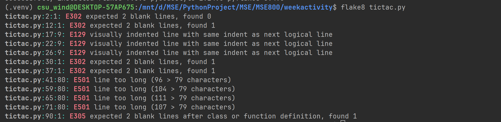
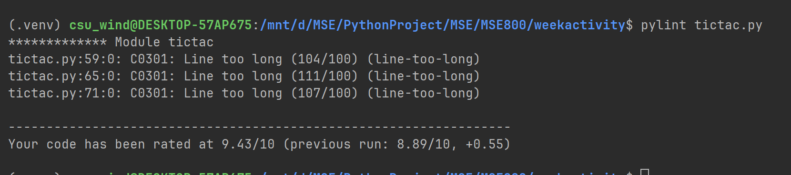

# Tic-Tac-Toe Game

This project is a simple, command-line implementation of the classic Tic-Tac-Toe game, written in Python (`tictac.py`).

## Game Summary

The game provides a 3x3 grid where two players, Player A ('O') and Player B ('X'), take turns placing their marks.

### How to Play
1.  **Run the script** from your terminal:
    ```sh
    python tictac.py
    ```
2.  **Enter Moves**: Players input their moves using a two-digit coordinate system, where the first digit represents the row and the second represents the column (e.g., `11` for the top-left corner, `33` for the bottom-right).
3.  **Winning**: The game ends when one player achieves three of their marks in a horizontal, vertical, or diagonal line.
4.  **Draw**: If the board fills up with no winner, the game is a draw.
5.  **Restart**: The game automatically clears the board and starts a new round after a win or a draw.

## Code Quality Analysis

The Python script has been analyzed using standard code quality tools to ensure readability and adherence to style guidelines.

### PEP8 Compliance Check
The code passes `pep8` style checks, indicating it is formatted correctly.


### Pylint Analysis
The code receives a high score from `pylint`, confirming good programming practices.

